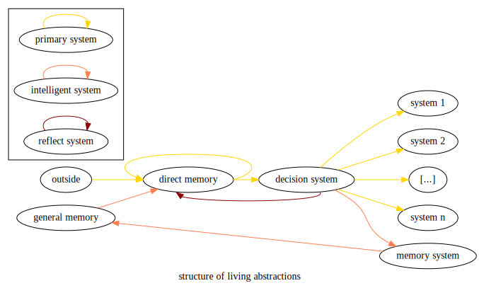

# crispy-parakeet

Git repository to store my ideas on Artificial Intelligence while improving my writing skills.

I will first note down my old work on the subject. Indeed, 3 to 4 years ago while I was studying in Lyon (France), I had some ideas concerning how to reproduce a living being.

The following diagram represents a general system for the living being. I will describe it more deeply in the following section.

The structure is composed of 3 systems that add up together. The **primary system** is the most simple one to accomplish a survival task. The **intelligent system** provide behaviour that can be understood through time. The **reflective system** bring the vision of oneself over oneself.

## Primary System
