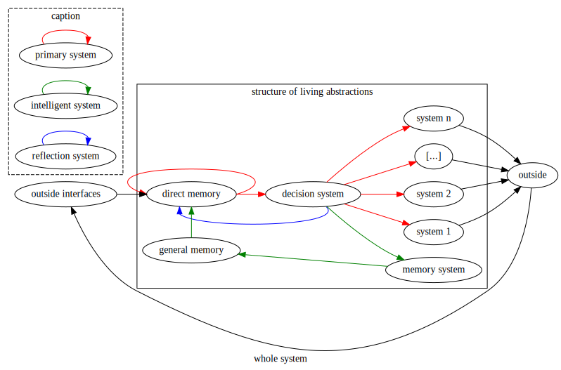
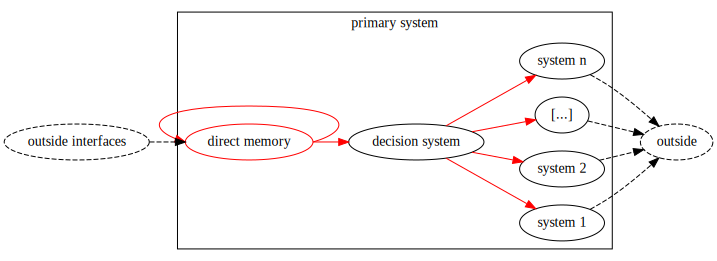
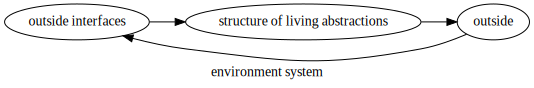
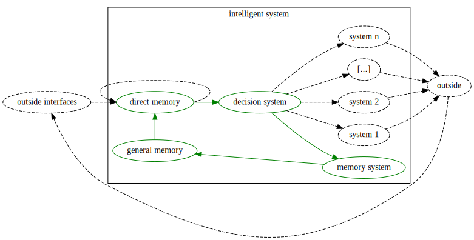
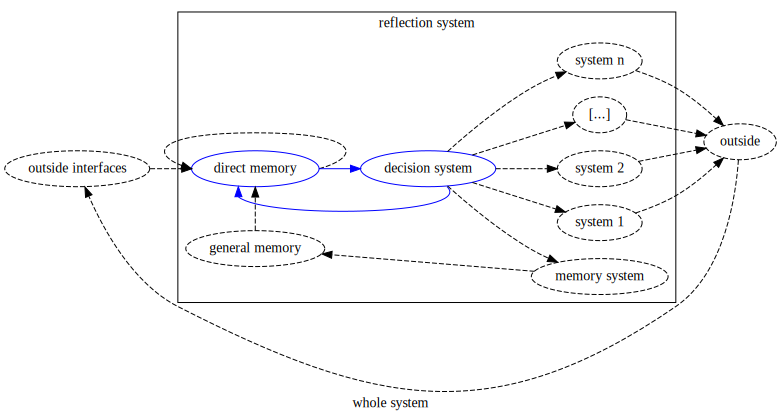
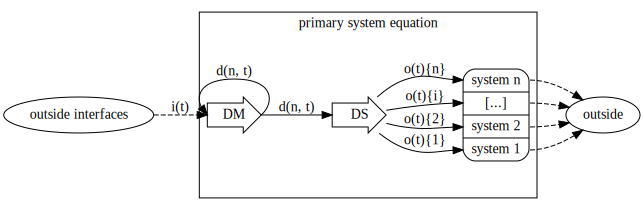

> I use the [DOT](https://graphviz.org/about/) language to create the diagrams and LaTeXiT for the equations (https://www.chachatelier.fr/latexit/)

# crispy-parakeet, The Loops of the Mind

The following diagram represents a general system for the living being. I will describe it more deeply in the following sections.

The structure is composed of 3 systems that add up together.
- The **Primary system** is the most simple one. It serves elementary purposes.
- The **Intelligent system** is slightly more complex and provides long term memory.
- The **Reflection system** is the more advanced. It is responsible for self-awareness.

## *Side notes*

*The purpose of the following work isn't to describe a specific living being. Thus, even by understanding all the concepts explained, you won't create a functional system.*

*The creation of a functional system is complex. It involves understanding each part with the others.*

*The following concepts are abstracts and apply to any technology, architecture, and study.*

*In further work, I will try to put into application these concepts. However, it is crucial to understand that it doesn't have to do with the application now.*

# The three Loops of the Mind

## Primary system

You can study the **Primary system** on its own. Indeed, an **Intelligent system** and a **Reflection system** are not necessary. Both are built on this first system to add values.

### Outside interfaces

**Outside interfaces** is the raw information perceived by the living being. This information comes from external and internal sensors.

Examples of outside information are vision, hunger, or touch.

### Direct memory

**Direct memory** processes the information from **Outside interfaces**.

How this information is processed depends on the internal architecture of the living being.

The past experiences of the living being influence the mechanism. However, what influenced the direct memory cannot be retrieved by the living being. It is not tangible information.

After being processed, the information is sent to the Decision system and back to **Direct memory**.

Thus, **Direct memory** can send similar information again even if outside information slightly change. Anyhow, **Direct memory** cannot remember information in the long term. The loop acts as a buffer memory to give more importance and persistence to potentially dangerous and interesting outside events.

It is worth mentioning that the living being doesn't perceive all this process.

### Decision system

The **Decision system** makes choices. Living beings are only aware of this system.

**Direct memory** and **Decision system** are distinct. Indeed, living beings that only have a **Primary system** perceive their choices through their consequences. Both **Direct memory** and **Decision system** systems are different, so processed information of **Direct memory** is sent back to **Direct memory**, while processed decisions of the **Decision system** are not. If both shared the same output, this wouldn't be possible.

*If right now, you think that you can be aware of your choices even if they don't have consequences, you're right. Just think about moving your arm without moving it to convince yourself of it. However, this is a complex behaviour that is not necessary for now. The primary system only describes what is crucial for living systems.*

*The Decision system is responsible for what you may call consciousness. However, be cautious when thinking so. First, remember that these concepts describe all living beings and that consciousness may be something specific to your species. Then, do not confuse consciousness and self-consciousness. The former is the perception of the surrounding environment, and the latter is the perception of your existence. You can decide without being aware of yourself. The concept of self-consciousness will come later with the Reflect system.*

### System-i

**System-i's** receive the choices made. Those are all different and control different parts of the object linked to the system (commonly called *body*).

**System-i's** can be complex, and their studies are not the aim here. They are specific to the living being that you examine.

Examples of **System-i's** are voice, movement of the body, or look.

**System-i's** have an immediate impact on the  **Outside**. So, **Direct memory** perceives their actions. This process describes the wide loop of life.

The **Primary system** only exists within the **Environment system**. **Environment system** links **Outside**, where you act, and **Outside interfaces**, where you sense.

I ignore the **Environment system** for now. Its mechanism is complex, and understanding them doesn't directly impact our understanding of the concepts explained here.

However, you shall keep in mind that without the **Environment system**, nothing exists.

## Intelligent system

The **Intelligent system** introduces the ability to process information from the past. It introduces the **Memory system** and the **General memory**.

The **Intelligent system** and the job of the **Direct memory** shall not be confused. **Direct memory** can process information from a recent past with continuity, while the **Intelligent system** provides information with discontinuity.

The **Intelligent system** brings the loop of intelligence.

### Memory system

The **Memory system** is another **System-i**. The **Memory system** is defined on its own because it is part of its loop.

The **Memory system** process the choice sent by the **Decision system** and send the result to **General memory**.

*You notice that each System-i's part of a loop. However, the loop most System-i's are in is the one of the Environment System. Here the difference is that the loop doesn't leave the living being abstraction.*  

*In a real-life application, the Memory system and the General memory can have similar implementation. Indeed, General memory acts as the environment of the Memory system. The Memory system shall have a method to interact with the General memory specifics to how they work. However, I don't look for practical implementation of the concept. If you are looking at it, you could conclude that your application needs a similar mechanism for the Memory system and the General memory. That won't contradict the concept explained.*

### General memory

**General memory** acts as a general store. It stores information based on what it received from the **Memory system**. The **General memory** then sends information to the Direct memory. The **General memory** sends information depending on the information it receives.

**General memory** acts as a general store. It stores information based on what it received from the **Memory system**. The **General memory** then sends information to the Direct memory. The **General memory** sends information depending on the information it receives.

**Direct memory** receives information from **General memory**, like from any other **Outside interface**. There is no distinction between how a sense is processed and how the memory is processed. That doesn't mean that **Direct memory** cannot give more importance to information from **General memory**.

*I don't answer how General memory processes information. This mechanism is a practical issue that solves for every specific case. Technologies will evolve, and what is to construct impossible today may not stay impossible for long. Keep in mind that those are just concepts and do not handle any practical implementation. As long as you respect the model, you could use a Neural Network, a File System, or Chemical Compounds.*

## Reflection system

The **Reflection system** is the most advanced. Thanks to it, living beings imagine they have interacted with the world. This complex behaviour leads to abstract imagination. In coordination with **Intelligent systems**, this provides deep knowledge as Mathematics, Physics or Philosophy.

However, the **Reflection system** only adds one link and no component. It loops the **Decision system** to **Direct memory**. Thus, you perceive choices as a sensation. This mechanism is awareness of yourself.

This loop mimics the loop of the **Environment system**. However, it bypasses the action of the **System-i's**.

# Mathematics definitions

In the following section, I will describe the three Loops of the Mind with mathematical notation. To simplify the description of the problem, I will work with matrixes.

## General definitions

First, here are four helpful matrixes that I will use along the way.

`n`, `m` are natural numbers greater than `0`.

The inscription `n x m` under the matrixes are the size of the matrixes, with `n` the number of rows and `m` the number of columns.

The first and the second ones are the matrix null and the matrix identity.

The third and the fourth ones are helpful to stack two vectors together.

## Primary system

Below is the primary system.

The vector `i(t)` contains the signals produced by each outside interface. It varies over time. There are `p` outside interfaces, `p` greater or equal to `0`. Thus `i` has `p` values.

`DM` is the function that represents the Direct memory. It takes as input a vector of size `a + p` and outputs a vector of size `n`.

`d(n, t)` is the output of the Direct memory. It varies over time and with each passage through the loop.

`DS` is the function that represents the Decision system. It takes as input a vector of size `a` and outputs a vector of size `q`. `q` is the number of System-i.

`o(t)` is the output of the Decision system. It varies over time. Each of its value impact one System-i.

The Outside interfaces (sensors) and the System-i's (effectors) are not part of the definition of the primary system. They are the boundary of the system. How they process information is highly dependant on their functionalities.

### Schema

### Helpers

### Equations

### Problem

The objective is to find the functions `DM` and `DS`.

Two questions remain:

1. Let `DMi` be an approximation of `DM`. How to measure how good the approximation is? (what is the error function)

2. Is the third equation correct? Should `o` only varies over time (`o(t)` versus `o(n, t)`)?

## Intelligent system

### Helpers

### Equations

