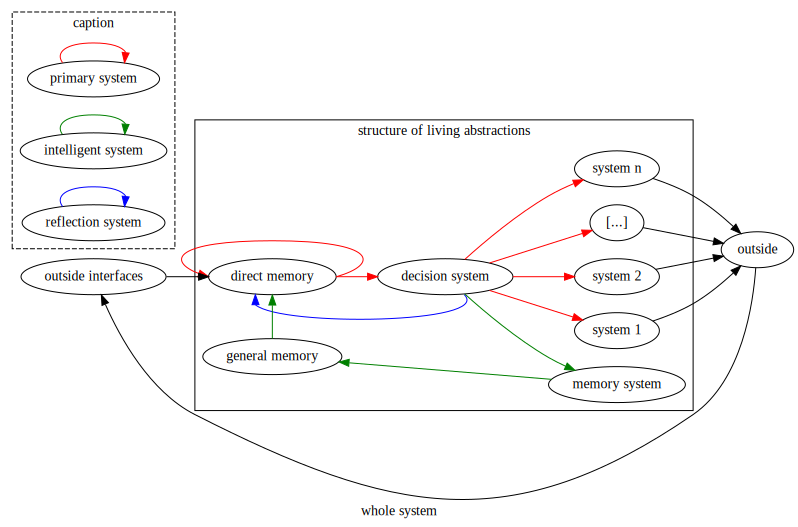
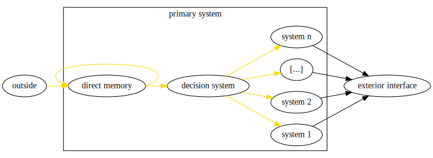
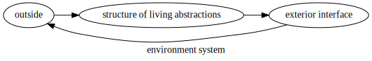
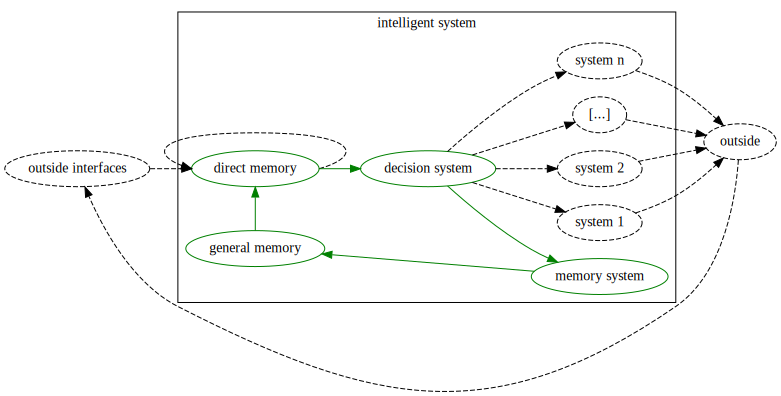
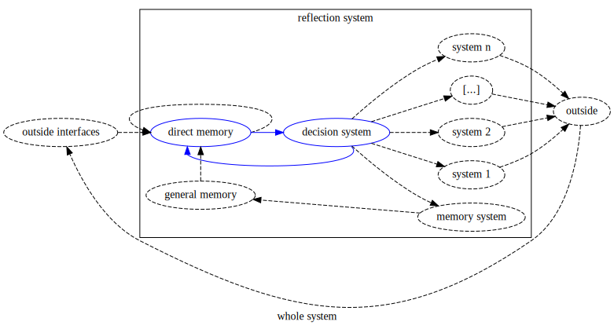

# crispy-parakeet

Git repository to store my ideas on Artificial Intelligence while improving my writing skills.

I will first note down my old work on the subject. I started thinking about living being theory in 2017 when I was studying in Lyon (France).

The following diagram represents a general system for the living being. I will describe it more deeply in the following sections.

The structure is composed of 3 systems that add up together.
- **Primary system** is the most simple one. It serves elementary purposes.
- **Intelligent system** is slightly more complex and provides long term memory.
- **Reflection system** is the more advanced. It is responsible for self-awareness.

## *Side notes*

*The purpose of the following work isn't to describe a specific living being. Thus, even by understanding all the concepts explained, you will not be able to create a functional system.*

*The creation of a functional system is complex. It involves understanding each part with the others.*

*The following concepts are abstracts and can be applied to any technology, architecture, and study.*

*In further work, I will try to put into application these concepts. However, it is crucial to understand that it doesn't have to do with the application now.*

## Primary system

You can study **Primary system** on its own. Indeed, **Intelligent system** and **Reflect system** are not necessary. Both are built on this first system to add values.

### Outside interfaces

**Outside interfaces** is the raw information perceived by the living being. This information comes from external and internal sensors.

Examples of outside information are vision, hunger, or touch.

### Direct memory

**Direct memory** processes the information from **Outside interfaces**.

How this information is processed depends on the internal architecture of the living being.

The past experiences of the living being influence the mechanism. However, what influenced the direct memory cannot be retrieved by the living being. It is not tangible information.

After being processed, the information is sent to the Decision system and back to **Direct memory**.

Thus, **Direct memory** can send similar information again even if outside information slightly change. Anyhow, **Direct memory** cannot remember information in the long term. The loop acts as a buffer memory to give more importance and persistence to potentially dangerous and interesting outside events.

It is worth mentioning that the living being doesn't perceive all this process.

### Decision system

**Decision system** makes choices. Living beings are only aware of this system.

**Direct memory** and **Decision system** are distinct. Indeed, living beings that only have **Primary system** perceive their choices through their consequences. Both **Direct memory** and **Decision system** systems are different, so processed information of **Direct memory** is sent back to **Direct memory**, while processed decisions of **Decision system** are not. If both shared the same output, this wouldn't be possible.

*If right now, you think that you can be aware of your choices even if they don't have consequences, you're right. Just think about moving your arm without moving it to convince yourself of it. However, this is a complex behaviour that is not necessary for now. The primary system only describes what is necessary for living systems.*

*Decision system may be understood as consciousness. However, be cautious when thinking so. First, remember that these concepts describe all living beings and that consciousness may be something specific to your species. Then, do not confuse consciousness and self-consciousness. The former is the perception of the surrounding environment, and the latter is the perception of your existence. You can decide without being aware of yourself. The concept of self-consciousness will come later with the Reflect system.*

### System-i

**System-i's** receive the choices made. Those are all different and control different parts of the object linked to the system (commonly called *body*).

**System-i's** can be complex, and their studies are not the aim here. They are specific to the living being that you examine.

Examples of **System-i's** are voice, movement the body, or look.

**System-i's** have an immediate impact on **Outside**. So, **Direct memory** perceives their actions. This process describes the wide loop of life.

**Primary system** only exists within the **Environment system**. **Environment system** links **Outside**, where you act, and **Outside interfaces**, where you sense.

I ignore the **Environment system** for now. Its mechanism is complex, and understanding them doesn't directly impact our understanding of the concepts explained here.

However, you shall keep in mind that without **Environment system**, nothing exists.

## Intelligent system

Intelligent system introduces the ability to process information from the past. It introduces Memory system and General memory.

Be cautious, you shall not confuse the job of Intelligent system and the job of Direct memory. Direct memory can process information from a close past with continuity, while Intelligent system adds a discontinuity to the process of past information.

Intelligent system brings the loop of intelligence.

### Memory system

Memory system is another System-i. Memory system is defined on its own because it is part of its own loop.

Memory system process the choice sent by Decision system and send the result to General memory.

*You notice that each System-i's part of a loop. However, the loop most System-i's are in is the one of the Environment System. Here the difference is that the loop doesn't leave the living being abstraction.*  

*In a real life application, Memory system and General memory can be deeply link together. Indeed, General memory is the environment of Memory system, thus Memory system shall have specific method to interact with General memory. However, I don't look for a physical implementation of the concept. If you are looking to it, you could conclude that your application need a similar implementation for Memory system and General memory. That won't contradict the concept explained.*

### General memory

General memory act as a general storage. It store information based on what it received from Memory system. General memory then send information to Direct memory. The information sent depends on the information received.

Direct memory will receive the information from General memory as any other Outside interfaces. This is important, there is no distinction between how a sense is processed and how the memory is processed. That doesn't mean that Direct memory cannot give more importance to information from General memory.

*I don't answer how the information is processed inside General memory. This is a practical issue that as to be solve for every specific cases. Moreover, technology will evolve, thus if I give an answer it will soon or later become wrong. Keep in mind that those are just concepts and do not handle any practical implementation. You could use a Neural Network, a File System, or Chemical Compounds, as long as the concepts are respected.*

## Reflection system

Reflection system is the most advanced system. Thanks to it, living beings imagine they have interacted with the world. This is a complex behaviour and lead to abstract imagination. In coordination with Intelligent system, this provides deep knowledges as Mathematics, Physics or Philosophy.

However, Reflection system only adds one link and no component. It loops Decision system to Direct memory. Thus, choices are now perceived as a sensation.

With a close look, you will see that this loop mimic the loop of the Environment system but cut the action of the System-i's.

