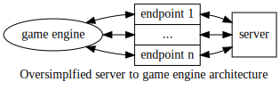

# Tasks

With my background, it is much easier for me to go for experimentation using software. I have the choice to implement the environment from scratch or to use a Game Engine.

## The environment

If I need to use physics-like rules and to detect collision between object, I will go for a Game Engine. I will use the open source Game Engine [Godot](https://godotengine.org). Godot mainly use the language GDScript.

If I don't need complex rules and collision detection, I may implement the environment from Scratch using [Javascript](https://developer.mozilla.org/en-US/docs/Web/JavaScript) or [Python3](https://docs.python.org/3.9/). However, I will have similar performance and opportunity using a Game Engine. Thus, it will be easier to use a Game Engine, even if I don't use the renderer. For now, I don't have specific reason to not use a Game Engine if the environment is simple, I will change my decision if I found one.

## Communication with the living abstraction

I have two options to implement the Loops of the Mind.

1. I implement it inside the Game Engine using GDScript (or one of the other supported language which are C, C# and VisualScript).

2. I implement a local server -in whatever language, probably Javascript or Python3- that hosts the code for the implementation of the Loops of the Mind. The Game Engine will then connect to the server endpoints to send information and to receive directives.

On the one hand, the first option is easier to implement, keep the code in the same place, and it is probably quicker at runtime. On the other hand, the second option offers the distinction with the environment and the living abstraction immediately with its architecture. Thus, it keeps the code more structure and easier to scale. Moreover, it avoids any interference between the two programs -the environment and the living abstraction-.

